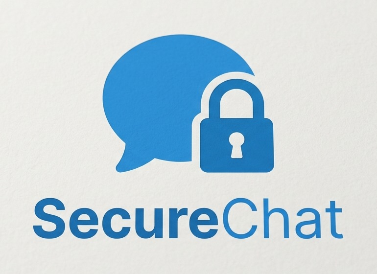

<div align="center">
  

  # SecureChat

  **Privacy-first, self-hostable messaging.**

  SecureChat is an open-source messaging platform engineered around consent-first
  connections, end-to-end encryption, and privacy controls that are discoverable
  instead of buried in a settings menu.

  [](#license)
  [](#quickstart)
  [](#quickstart)
  [](#quickstart)
  [](#android-app)
  [](#continuous-integration)
</div>

## Overview

Most messaging apps treat privacy as a paragraph in a policy page. SecureChat
treats it as part of the product: every connection requires consent, message
content is end-to-end encrypted in the browser before it leaves the device, and
each privacy decision is explained in plain language at the moment it matters —
with no dark patterns.

The project is fully self-hostable: a web app (React/Vite), a Node.js and
MongoDB backend with real-time Socket.IO messaging, and an Android wrapper
built with Capacitor.

## Live demo

The deployed build runs on AWS and can be opened directly in a browser, or
installed from the Android APK in the repository.

| Layer | URL |
|---|---|
| **Web app** | https://d2bdhd1gcudfjg.cloudfront.net |
| **API + Socket.IO** | https://d3qye3r9n8r030.cloudfront.net |
| **Android APK** | [`SecureChat-v2.apk`](SecureChat-v2.apk) (Android 10+) |

Deployment architecture, setup commands and cost notes are documented in
**[DEPLOYMENT.md](DEPLOYMENT.md)**.

> All data in the live demo is real — registrations use your actual email. For
> evaluation, create a throwaway account.

## Features

- **Consent-first connections** — discovery is limited and identity stays
  private until someone accepts your introduction request
- **End-to-end encryption** — AES-256-GCM message keys wrapped per-device with
  RSA-OAEP; browser private keys are non-extractable and never leave the device
- **Live messaging** — Socket.IO delivers messages, typing indicators, presence
  and read receipts in near real time
- **Emoji reactions** — react to messages with live cross-device sync and an
  in-composer emoji picker
- **Private groups** — group creation with explicit member consent
- **Encrypted attachments** — file and voice messages, encrypted before upload
  with EXIF/GPS metadata stripped
- **Privacy center** — discoverability, profile visibility, presence/typing
  signals, read receipts, disappearing messages, block/clear controls
- **Data sovereignty** — auditable data map, encrypted export, and
  password-confirmed account-data deletion
- **Accessibility** — responsive layouts, WCAG-contrast light/dark themes,
  high-contrast mode, text-size scaling and reduced-motion support
- **Google Sign-In** via server-verified OIDC (optional; see DEPLOYMENT.md)
- **Android app** — Android 10+ (minSdk 29) Capacitor build with CI artifacts

## Security & transparency

SecureChat is engineered to be honest about what it protects:

- New message and attachment content is end-to-end encrypted; the server stores
  ciphertext and per-device wrapped keys, never plaintext.
- Operational metadata (membership, timestamps, delivery state) remains
  server-visible by design and is disclosed in the app's data map.
- The stack does **not** claim Signal Protocol–level guarantees: no Double
  Ratchet forward secrecy, sealed sender, or protection against a malicious
  server swapping public keys. These boundaries are stated in the app, not
  hidden.
- No analytics collector, no last-seen history, no server-held E2EE keys, no
  public avatar URLs.

Details, including responsible-disclosure guidance, are in
**[SECURITY](SECURITY.md)**.

## Technology stack

| Layer | Technologies |
|---|---|
| Frontend | React, Vite, React Router, Socket.IO client, Web Crypto / IndexedDB |
| Backend | Node.js, Express, Socket.IO, MongoDB / Mongoose |
| Android | Capacitor 7 (`securechat-android/`), minSdk 29 · targetSdk 35 |
| Infrastructure | AWS S3 + CloudFront, EC2 + nginx + PM2, managed by GitHub Actions |

## Repository layout

```
securechat-backend/   Express + MongoDB + Socket.IO API
securechat-frontend/  React + Vite web application
securechat-android/   Capacitor Android wrapper
.github/workflows/    CI (frontend build + Android APK/AAB artifacts)
```

## Quickstart

### Prerequisites

- Node.js 20+ and npm
- MongoDB 7 running locally (or a connection string in `.env`)
- A modern Chromium/Edge/Firefox browser

### 1. Backend

```bash
cd securechat-backend/backend
cp .env.example .env
npm install
npm run dev
```

The API runs on `http://localhost:5000`. For Google Sign-In, add your
`GOOGLE_CLIENT_ID` to `.env`.

### 2. Frontend

```bash
cd securechat-frontend/frontend
npm install
npm run dev
```

Open `http://localhost:5173`. The frontend falls back to `localhost:5000` for
the API when `VITE_API_URL` is not set. For production, bake in the API origin
and Google client ID:

```bash
VITE_API_URL="https://your-api.example.com" \
VITE_GOOGLE_CLIENT_ID="your-client-id" \
npm run build
```

### 3. Android app

> Requires JDK 21 and the Android SDK (`ANDROID_HOME` or a `local.properties`
> `sdk.dir`).

```bash
cd securechat-frontend/frontend && npm ci && npm run build
cd ../../securechat-android && npm ci && npx cap sync android
cd android && ./gradlew assembleDebug
# Output: android/app/build/outputs/apk/debug/app-debug.apk
```

The Android WebView uses the `https://securechat.app` origin. For Google
Sign-In inside the app, add that origin to the OAuth client's *Authorized
JavaScript origins* (see DEPLOYMENT.md). For self-hosted deployments, update the
backend CORS allowlist in `src/server.js` to include your app origin.

> Never commit `.env`, private uploads, database credentials or real user data.

## Continuous integration

The `android-build.yml` workflow builds the frontend with production env vars,
syncs it into the Capacitor project and publishes APK + AAB artifacts on every
push to `main`. The frontend and backend CI jobs run with Node 22; the Android
toolchain uses JDK 21 and `android-actions/setup-android`.

## Contributing

Contributions are welcome. Please open an issue first for substantial changes,
keep PRs focused, and do not commit secrets or real user data. Every change
should preserve the project's privacy-by-default behavior.

## License

Released under the [MIT License](LICENSE). Third-party libraries retain their
own licenses.

---

<div align="center">
  <strong>A secure experience is only secure when people understand it.</strong>
</div>